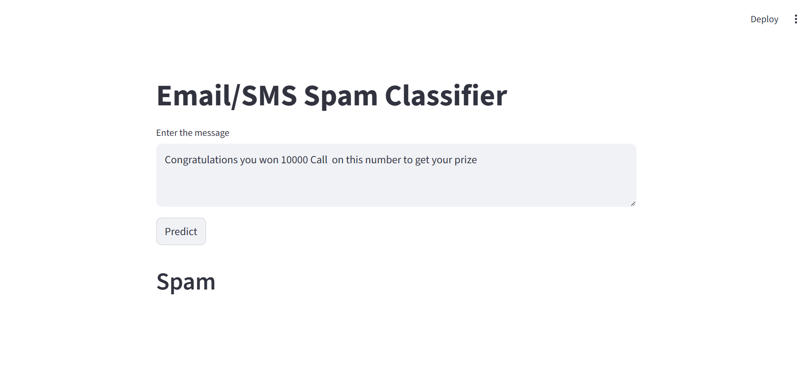

# SMS Spam Detection App

A Machine Learning and NLP based web application that predicts whether an SMS message is **Spam** or **Ham (Not Spam)**.

## Project Preview



## Features

- Detects spam messages instantly
- Clean and simple Streamlit UI
- Text preprocessing using NLP
- TF-IDF Vectorization
- Trained using Random Forest Classifier

## Tech Stack

- Python
- Pandas
- NumPy
- Scikit-learn
- NLTK
- Streamlit

## How to Run This Project

```bash
pip install -r requirements.txt
streamlit run app.py
```

## Example Inputs

### Spam Message

You are a lucky winner! Call now to claim your reward.

### Ham Message

Hey, are we still meeting at 6 PM today?

## Files Included

- app.py
- model.pkl
- vectorizer.pkl
- spam.csv
- requirements.txt

## Author

Akash Kumar
